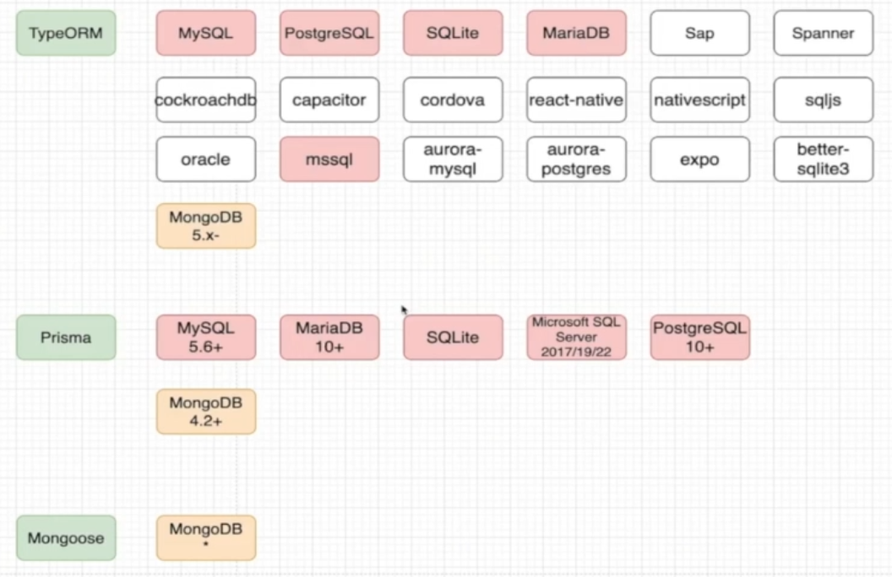

<!--
 * @Author: humengchuan 531537052@qq.com
 * @Date: 2025-08-26 11:38:32
 * @LastEditors: humengchuan 531537052@qq.com
 * @LastEditTime: 2025-09-01 12:52:36
 * @FilePath: \project\work-tool\docs-vitepress\node-learn.md
 * @Description:
-->

# nodejs docs

nodejs 如何防止接口被刷 express-rate-limit

发送邮件 Nodemailer

操作数据关系库
mongoose sequelize typeorm Prisma

