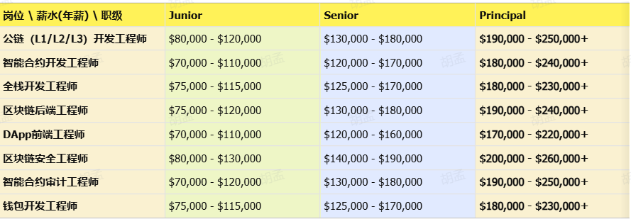

<!--
 * @Author: HuMeng 531537052@qq.com
 * @Date: 2026-05-04 14:21:50
 * @LastEditors: HuMeng 531537052@qq.com
 * @LastEditTime: 2026-05-28 08:52:25
 * @FilePath: \work-tool\docs-vitepress\src\web3\study.md
 * @Description:
-->

#### web3 学习资料

https://kcno38rbm7bc.feishu.cn/wiki/OQ5lwXujliSOA4khSZjc0jagnYJ?from=from_copylink

```md
### 干工作最主要的是赚钱，工资

远程开发薪资怎么发，以及社保是怎么交的?

1. 发放形式
   一般情况下，北美的公司都是直接发美金或”其他”，有一些方式可以提现，会有一点点手续费团队比较大的，会找国内的代理公司给你发放工资并缴纳社保公积金，具体还要看企业
2. 发放时间
   很多人以为远程工作是项目结算，跟大家说下，全职远程跟你在国内线下的全职是一样的，每月固定发薪日。而且福利待遇、甚至离职、裁员都会比传统开发公司高，N+3，13、14薪都是最起步的
3. 激励
   大家容易忽视，其实远程工作也是有激励的，你的收入不仅仅是工资。对于区块链企业，有的给RSU，而有些会给Token激励
```


